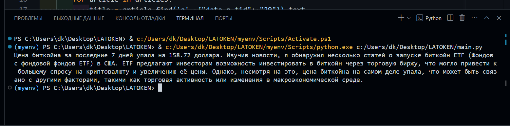

# PriceAgent 📈

## О проекте 📚

PriceAgent - это надежный помощникдля анализа цен на биткоин и другие криптовалюты.Разработанный на Python с использованием веб-скреппинга и вызовов API,он предоставляет последние новости обиткоинеи исторические данные о ценах за последние семь дней.Ассистент основан на ModelGpt.

## Особенности 🌟

- **Получайте* свежие новости о биткоинах от Google. 
- **Получаем* исторические данные по ценам на рынке биткоина за последние семь дней (по состоянию на сегодняшнее утро). 
- **Анализ цен*: комбинация новостей текущей цены, исторических данных и текущих цен для ответа на вопросы пользователей о ценах на криптовалюты. 

## Использование 💻

### Установите необходимые зависимости:

pip install -r requirements.txt

Внесение вклада 🤝
Мы приветствуем ваш вклад! Если вы хотите внести свой вклад в PriceAgent, следуйте указаниям в CONTRIBUTING.md.

Лицензия 📄
Этот проект распространяется под лицензией MIT.

**Результат анализа, новости + анализ от gpt**

